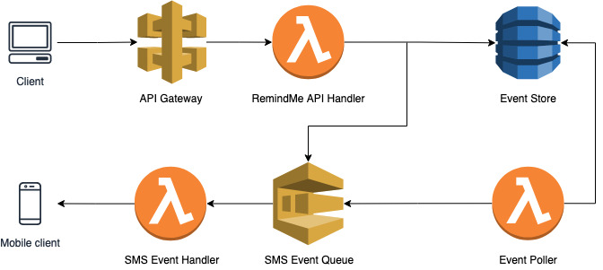

# RemindMe Backend

This is the backend for the RemindMe application. The front end lives in a separate repository and can be found here: https://github.com/b-saad/RemindMe
 
This  consists of scheduling system stores and processes events via timestamps. The system is detailed below.

## Architecture

The backend is architected to use severless AWS services to avoid a web server deployment and is structured as follows:


### Components

#### API Gateway

- Acts as Proxy and forwards requests to the RemindMe API handler

#### RemindMe API Handler

- Lambda function that receives, validates and API requests
- Determines wether an event is far enough in the future to be stored in the Event Store or whether it should be sent straight to the appropriate event queue.

#### Event Store

- DynamoDB table that stores events that are scheduled in the far future
- Each event has a TTL so the event store cleans itself up

#### Event Poller

- Polls the Event Store database every N minutes for events in the next scheduling window
- Sends retrieved events to the appropriate event queue

#### SMS Event Queue

- Standard SQS queue
- Message delays are used at the message level so each event can be scheduled with precision

#### SMS Event Handler

- Send SMS reminders for events retrieved from the queue

## How to Deploy

Requirements:

- Terraform 1.0.7
- AWS CLI V2
- AWS credentials stored in env variables so terraform can access them
- Twilio Account with Phone number
- GNU Make

This application is maintained deployed using terraform. To kept rack of the resources Terraform requires a backend and S3 is used in this project. The folder `terraform-remote-state` contains the files necessary to set up the backend and only needs to be done once.

### Terraform Backend Setup (one time)

Run the following commands:

```bash
cd terraform-remote-state
terraform init
terraform apply
```

### Deploy Backend

1. Define required tfvars

	The backend requires 3 environment variables to defined in a tfvars file. In the `terraform` directory create the file `prod.auto.tfvars` and provide values for the following variables
	
	```
	twilio_account_sid  = "******"
	twilio_auth_token   = "*****************"
	twilio_phone_number = "***********"
	```

2. Package lambdas

	Each lambda is needs to packaged into a zip file. Which can be accomplished by going into each lambda directory and running the `make package` command. Ex. to package the `event-poller` lambda we do
	```bash
	cd src/event_poller_lambda
	make package
	```
	The zip file is automatically moved to the correct location

3. Terraform Apply

	Run the following commands to deploy the system and all its components

	```
	cd terraform
	terraform apply
	```

## TODO

- Add support for email events by adding an Email Event Handler lambda 

